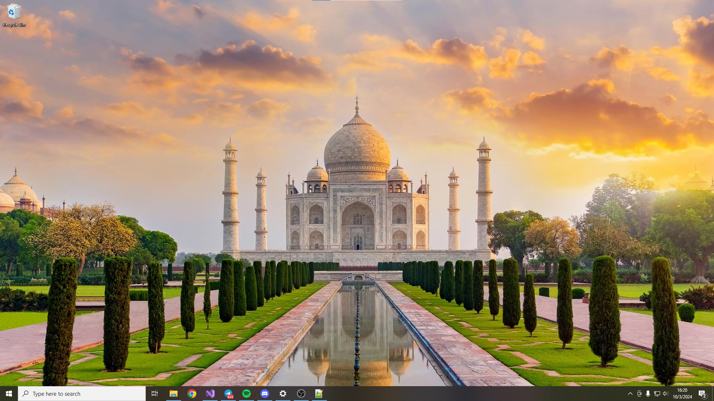

# Everyday Wallpaper



## Description

Everyday Wallpaper is a Windows application that automatically downloads and sets a new wallpaper from Bing every day. The application runs in the system tray and allows users to quickly exit from the context menu.

## Features

- **Automatic Wallpaper Updates**: Downloads and sets Bing's daily wallpaper every 30 minutes.
- **System Tray Integration**: Minimalistic interface with a tray icon.
- **Context Menu**: Access a context menu by right-clicking the tray icon.

## Prerequisites

- Windows operating system
- C++ compiler

## Installation

1. Clone the repository:
    ```bash
    git clone https://github.com/im-tesla/EverydayWallpaper.git
    ```
   
2. Navigate to the project directory:
    ```bash
    cd EverydayWallpaper
    ```

3. Compile the application using your preferred C++ compiler.

## Usage

1. Run the application.
2. Right-click the tray icon to see the current wallpaper and exit option.
3. The application will update the wallpaper automatically everyday.

## Code Overview

The main functionalities are encapsulated in the following key components:

- **Tray Icon Management**: Creates and manages the system tray icon.
- **Wallpaper Retrieval**: Fetches the current wallpaper from Bing.
- **Context Menu**: Provides options to view the current wallpaper name and exit the application.

## Contribution

Contributions are welcome! Feel free to fork the repository and submit a pull request.

## License

This project is licensed under the GNU License. See the [LICENSE](LICENSE) file for details.
